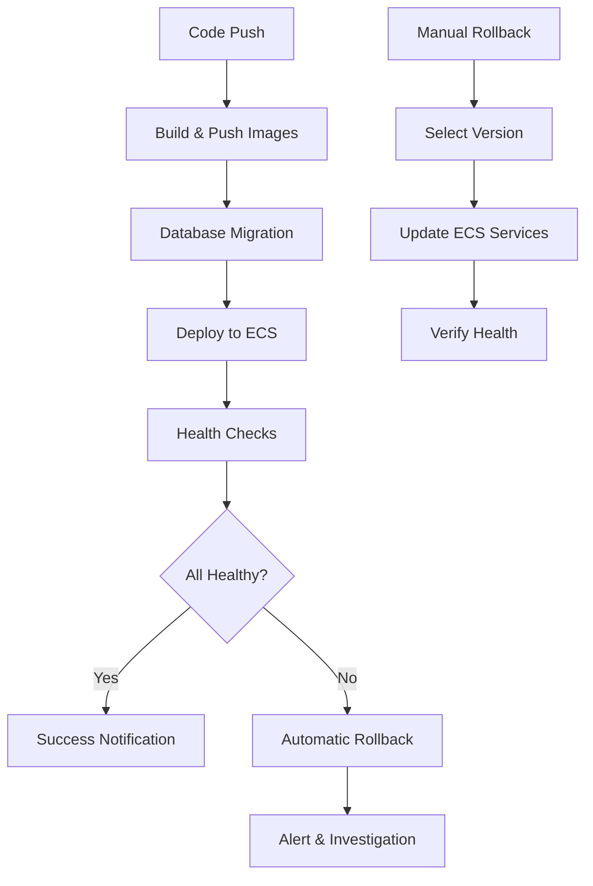

# PhotoPoo AWS Microservices Deployment Guide

This document provides comprehensive instructions for deploying the PhotoPoo application to AWS using microservices architecture with GitHub Actions.

## 🏗️ Architecture Overview

The PhotoPoo application is deployed as 5 separate microservices on AWS ECS Fargate:

- **Auth Service** (`photopoo-auth`) - Handles authentication and setup endpoints
- **Social Service** (`photopoo-social`) - Manages friends and friendship requests
- **Posts Service** (`photopoo-posts`) - Handles post creation, updates, and retrieval
- **Chat Service** (`photopoo-chat`) - Manages chat rooms and messaging
- **Users Service** (`photopoo-users`) - User profile management

### Infrastructure Components

- **ECS Fargate** - Serverless container orchestration
- **Application Load Balancer (ALB)** - Traffic routing and SSL termination
- **Amazon ECR** - Container registry
- **RDS PostgreSQL** - Primary database
- **ElastiCache Redis** - Caching and session management
- **CloudWatch** - Logging and monitoring
- **Secrets Manager** - Secure credential storage

## 🚀 Deployment Workflows

### 1. Infrastructure Management (`infrastructure.yml`)

Manages AWS infrastructure using Terraform Infrastructure as Code (IaC).

#### Usage:
```bash
# Via GitHub Actions UI
1. Go to Actions tab
2. Select "AWS Infrastructure Management"
3. Click "Run workflow"
4. Choose:
   - Action: plan/apply/destroy
   - Environment: staging/production
```

#### Manual Trigger:
```yaml
on:
  workflow_dispatch:
    inputs:
      action:
        - 'plan'     # Preview changes
        - 'apply'    # Apply changes
        - 'destroy'  # Destroy infrastructure
      environment:
        - 'staging'
        - 'production'
```

### 2. Microservices Deployment (`deployment-aws.yml`)

Main deployment pipeline for building and deploying microservices.

#### Automatic Triggers:
- Push to `main`, `develop`, `deployment-aws-production`, `deployment-aws-staging`
- Pull requests to `main`

#### Manual Trigger:
```yaml
on:
  workflow_dispatch:
    inputs:
      environment: 'staging' | 'production'
      services: 'all' | 'auth-service,posts-service'  # comma-separated
```

#### Pipeline Stages:

1. **Build & Push** - Docker images built and pushed to ECR
2. **Database Migration** - Applies database migrations
3. **Deploy Microservices** - Updates ECS services with new images
4. **Health Checks** - Verifies all services are healthy
5. **Notifications** - Sends deployment status notifications

### 3. Monitoring (`monitoring.yml`)

Continuous health monitoring of deployed services.

#### Features:
- **Health Checks** - HTTP endpoint monitoring every 5 minutes
- **Performance Metrics** - CPU/Memory utilization tracking
- **Alerting** - Slack notifications for unhealthy services
- **CloudWatch Integration** - AWS native monitoring

#### Manual Health Check:
```bash
# Via GitHub Actions
1. Actions → "Microservices Monitoring"
2. Run workflow
3. Select environment
```

### 4. Emergency Rollback (`rollback.yml`)

Emergency rollback capabilities for service recovery.

#### Rollback Strategies:
- **Previous Version** - Roll back to immediately previous deployment
- **Specific Version** - Roll back to a specific task definition revision
- **Blue-Green Switch** - Switch traffic between environments (planned)

#### Usage:
```bash
# Emergency rollback
1. Actions → "Emergency Rollback"
2. Select:
   - Environment: staging/production
   - Services: all or specific services
   - Strategy: previous_version/specific_version
   - Target version (if specific_version)
```

## 🔧 Setup Instructions

### 1. AWS Prerequisites

Ensure the following AWS resources are configured:

#### IAM Roles:
```bash
# ECS Task Execution Role
photopoo-ecs-task-execution-role-{environment}

# ECS Task Role
photopoo-ecs-task-role-{environment}
```

#### Secrets Manager:
```bash
# Database password
photopoo-db-password

# Redis password
photopoo-redis-password
```

#### S3 Bucket:
```bash
# Terraform state storage
photopoo-terraform-state
```

### 2. GitHub Secrets Configuration

Configure the following secrets in your GitHub repository:

#### Required Secrets:
```yaml
AWS_ACCESS_KEY_ID: <AWS Access Key>
AWS_SECRET_ACCESS_KEY: <AWS Secret Key>
ECR_REGISTRY: <Account-ID>.dkr.ecr.us-west-2.amazonaws.com
SERVERPOD_PASSWORDS: <Serverpod passwords YAML content>
ALB_DNS_NAME: <Application Load Balancer DNS name>

# Optional - for notifications
SLACK_WEBHOOK_URL: <Slack webhook for notifications>
```

#### Serverpod Passwords Format:
```yaml
# config/passwords.yaml content
shared:
  database:
    host: <RDS_ENDPOINT>
    port: 5432
    name: photopooserverpod
    user: postgres
    password: <DB_PASSWORD>

  redis:
    enabled: true
    host: <REDIS_ENDPOINT>
    port: 6379
    password: <REDIS_PASSWORD>
```

### 3. Environment Setup

#### Staging Environment:
- Cluster: `photopoo-cluster-staging`
- Database: `photopoo-db-staging` (db.t3.micro)
- Redis: `photopoo-redis-staging` (cache.t3.micro)
- Services: `photopoo-{service}-service-staging`

#### Production Environment:
- Cluster: `photopoo-cluster-production`
- Database: `photopoo-db-production` (db.t3.medium)
- Redis: `photopoo-redis-production` (cache.t3.medium)
- Services: `photopoo-{service}-service-production`

## 🐳 Docker Configuration

Each service has its own Dockerfile configuration:

### Service-Specific Environment Variables:
```dockerfile
# Auth Service
ENV services=auth,setup

# Social Service
ENV services=friends,friendshipRequest

# Posts Service
ENV services=posts

# Chat Service
ENV services=rooms

# Users Service
ENV services=users
```

### Common Configuration:
```dockerfile
ENV runmode=production
ENV serverid=default
ENV logging=normal
ENV role=microservice
EXPOSE 8080 8081 8082
```

## 🔍 Monitoring & Debugging

### Health Check Endpoints:
```bash
# Service health checks
https://<ALB-DNS>/auth/health
https://<ALB-DNS>/social/health
https://<ALB-DNS>/posts/health
https://<ALB-DNS>/chat/health
https://<ALB-DNS>/users/health
```

### CloudWatch Logs:
```bash
# Log groups
/ecs/photopoo-auth-service
/ecs/photopoo-social-service
/ecs/photopoo-posts-service
/ecs/photopoo-chat-service
/ecs/photopoo-users-service
```

### ECS Service Debugging:
```bash
# Check service status
aws ecs describe-services \
  --cluster photopoo-cluster-staging \
  --services photopoo-auth-service-staging

# View service events
aws ecs describe-services \
  --cluster photopoo-cluster-staging \
  --services photopoo-auth-service-staging \
  --query 'services[0].events'

# Check task logs
aws logs get-log-events \
  --log-group-name /ecs/photopoo-auth-service \
  --log-stream-name <stream-name>
```

## 🚨 Emergency Procedures

### Service Failure Response:

1. **Immediate Assessment**:
   ```bash
   # Check which services are failing
   GitHub Actions → Microservices Monitoring → Run workflow
   ```

2. **Quick Rollback**:
   ```bash
   # Emergency rollback
   GitHub Actions → Emergency Rollback → Run workflow
   # Select failed services and 'previous_version'
   ```

3. **Investigation**:
   ```bash
   # Check CloudWatch logs
   AWS Console → CloudWatch → Log groups → /ecs/photopoo-{service}

   # Check ECS service events
   AWS Console → ECS → Clusters → photopoo-cluster-{env} → Services
   ```

### Database Issues:
```bash
# Check database connectivity
# Access ECS task and test connection
aws ecs execute-command \
  --cluster photopoo-cluster-staging \
  --task <task-id> \
  --container photopoo-auth-service \
  --interactive \
  --command "/bin/sh"
```

### Network Issues:
```bash
# Verify ALB target health
AWS Console → EC2 → Load Balancers → photopoo-alb-{env}
# Check target group health
```

## 📋 Best Practices

### Deployment:
- **Always deploy to staging first**
- **Run health checks after deployment**
- **Monitor logs during deployment**
- **Have rollback plan ready**

### Monitoring:
- **Set up Slack notifications**
- **Monitor CloudWatch metrics**
- **Regular health check reviews**
- **Performance baseline tracking**

### Security:
- **Rotate secrets regularly**
- **Use least privilege IAM policies**
- **Enable VPC flow logs**
- **Regular security updates**

### Cost Optimization:
- **Use appropriate instance sizes**
- **Monitor resource utilization**
- **Scale services based on demand**
- **Review AWS costs monthly**

## 🔄 CI/CD Workflow Summary



## 📞 Support & Troubleshooting

For deployment issues:
1. Check GitHub Actions workflow logs
2. Review CloudWatch logs
3. Verify AWS resource health
4. Use emergency rollback if necessary
5. Create GitHub issue with deployment details

---

**Next Steps:**
1. Run infrastructure setup: `Actions → AWS Infrastructure Management → apply`
2. Deploy services: `Actions → Deploy Microservices to AWS → staging`
3. Verify deployment: `Actions → Microservices Monitoring`
4. Test rollback procedure in staging environment